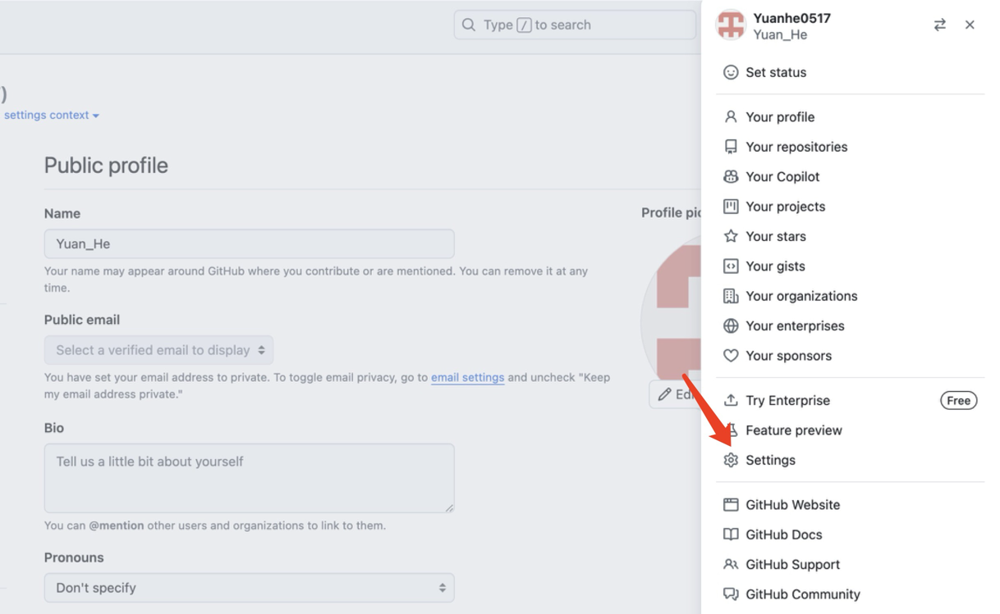
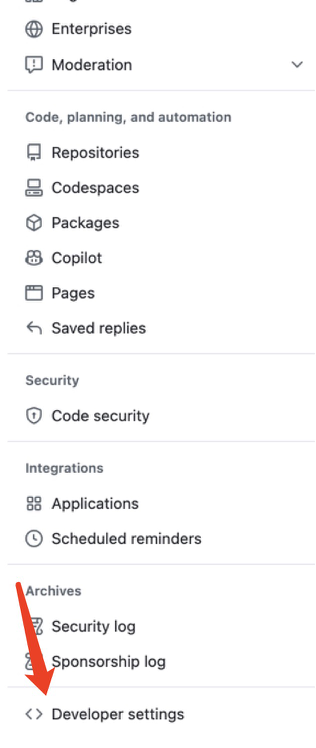
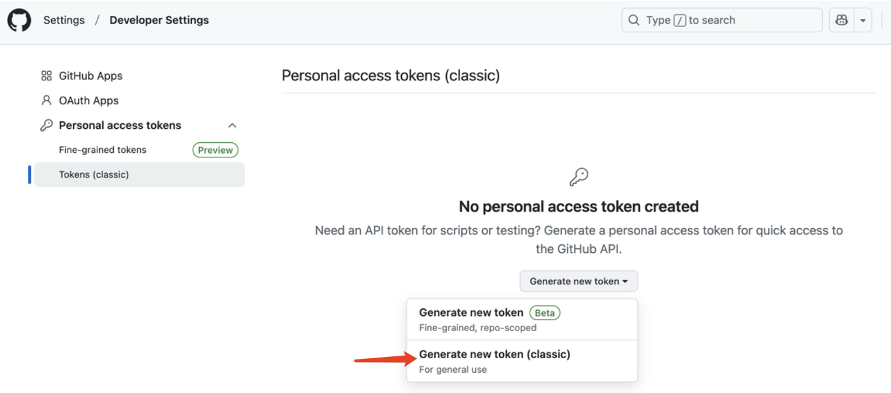
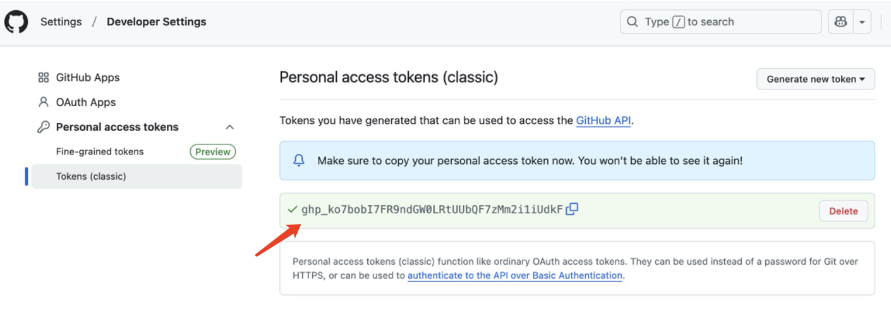
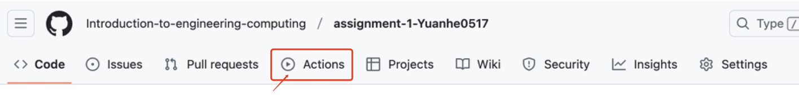

# Assignment-0220
---
## 如何开始：以Problem1 为例
1. **克隆仓库**
   ```bash

   git clone https://github.com/your-classroom/assignment.git

   cd assignment/problem1

   ```

2. **编写代码**
   - 在 `main.py` 中实现 `calculate_product()` 函数

   - 通过标准输入获取数据

3. **推送修改到GitHub**

   ```bash

   git add main.py

   git commit -m "完成题目"

    ```
   
   下一步就是将本地文件重载到线上仓库，这一步我们需要通过**密钥**来进行身份验证：
   
   进入setting
   

   进入general setting,获取密钥
   
   
   
   
   使用
   ```
   git push 
   ```
   会要求输入你的帐号名与**密钥**

5. **在仓库的 **Actions** 标签页确认测试通过**

